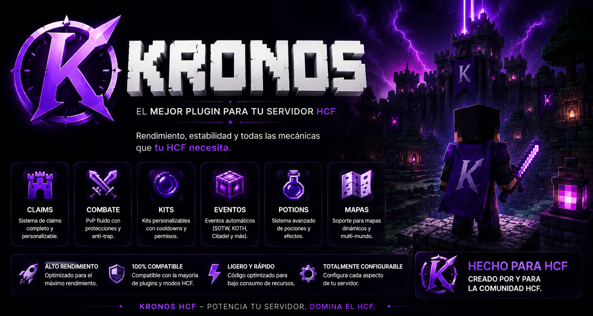

# Kronos HCF

A production-ready **Hardcore Factions** plugin for Spigot 1.13.2 servers, built with a clean Domain-Driven Design architecture and full async I/O.


---

## Tech Stack

| Component | Technology |
|---|---|
| Minecraft server | Spigot 1.13.2 |
| Dependency injection | Google Guice 5 |
| Primary persistence | MongoDB (via MongoDB Java Driver) |
| Timer / deathban cache | Redis (via Lettuce async client) |
| Economy bridge | Vault |
| Event bus | Guava EventBus |
| Build system | Gradle 8 + Shadow plugin 8.3.5 |
| Java target | Java 11 |

---

## Module Overview

| Module | Artifact | Description |
|---|---|---|
| `kronos-common` | library | Shared utilities: command framework, DB factories, SOTW/EOTW service, config helpers, exception hierarchy |
| `kronos-api` | library | Public read-only API exposed to external plugins via Bukkit `ServicesManager` |
| `kronos-economy` | library | Vault economy wrapper with async `CompletableFuture` API |
| `kronos-players` | library | HCF player profiles, deathban (Redis-backed), crate locations |
| `kronos-timers` | library | Per-player timers (combat tag, PvP, enderpearl, etc.) stored in Redis with TTL |
| `kronos-factions` | library | Faction domain: members, roles, DTK, ally/enemy relations, faction bank |
| `kronos-claims` | library | Chunk-based territory system with SafeZone, WarZone, KOTH, and Faction claim types |
| `kronos-koth` | library | King of the Hill event zones, creation sessions, capture lifecycle |
| `kronos-classes` | library | HCF combat classes (Archer, Bard, Rogue, Miner, Knight, Diamond) |
| `kronos-spawn` | library | Protected spawn zone with wand-based setup |
| `kronos-scoreboard` | library | Sidebar scoreboard with 1-second timer updates and 5-second async stat refresh |
| `kronos-plugin` | plugin jar | Bootstrap module: Guice wiring, command and listener registration, API exposure |

---

## Architecture Overview

### Module Dependency Graph

```
kronos-plugin
  ├── kronos-api
  │     └── (all domain modules)
  ├── kronos-scoreboard
  │     ├── kronos-timers
  │     ├── kronos-factions
  │     ├── kronos-economy
  │     └── kronos-koth
  ├── kronos-factions
  │     ├── kronos-players
  │     ├── kronos-economy
  │     └── kronos-common
  ├── kronos-claims
  │     └── kronos-factions
  ├── kronos-koth
  │     └── kronos-common
  ├── kronos-players
  │     └── kronos-common
  ├── kronos-timers
  │     └── kronos-common
  ├── kronos-spawn
  │     └── kronos-common
  ├── kronos-classes
  │     └── kronos-players
  └── kronos-economy
        └── kronos-common
```

### Event Flow (Guava EventBus)

All cross-module communication uses domain events posted on a shared `EventBus` singleton bound by `RootModule`. The flow is:

1. A service layer completes a business operation (e.g. a faction member dies).
2. The service posts a domain event (e.g. `FactionDtkDecrementedDomainEvent`).
3. Any `@Subscribe`-annotated listener in any module receives the event synchronously.
4. Listeners react without coupling directly to the originating service.

Examples of domain events:

| Event | Source module | Typical consumer |
|---|---|---|
| `PlayerTimerStartedDomainEvent` | `kronos-timers` | `ScoreboardManager`, `TimerListener` |
| `PlayerTimerExpiredDomainEvent` | `kronos-timers` | `ScoreboardManager`, `TimerListener` |
| `FactionCreatedDomainEvent` | `kronos-factions` | Logging, tab-list |
| `FactionRaidableDomainEvent` | `kronos-factions` | `PvpListener`, announcements |
| `FactionDtkDecrementedDomainEvent` | `kronos-factions` | `ScoreboardManager` |
| `FactionClaimedDomainEvent` | `kronos-claims` | `ClaimListener` cache invalidation |
| `KothStartedDomainEvent` | `kronos-koth` | `ScoreboardManager` |
| `KothCapturedDomainEvent` | `kronos-koth` | `ScoreboardManager`, crate delivery |

### Async Pattern (CompletableFuture)

All I/O operations return `CompletableFuture<T>`. The rule is:

- **Never block the Bukkit main thread** with database calls.
- MongoDB operations run on the MongoDB driver's thread pool.
- Redis operations run on Lettuce's Netty event loop.
- Vault operations **must** run on the main thread — `VaultEconomyService` uses a custom `mainThreadExecutor` that dispatches via `BukkitScheduler.runTask` when called from async context.
- Results are applied back to domain objects in `.thenAccept` / `.thenCompose` callbacks.

### Guice DI

`RootModule` is the composition root. It installs each domain module (`TimersModule`, `FactionsModule`, `ClaimsModule`, etc.) and binds configuration values from `config.yml` as `@Named` constants. All service singletons are wired here.

---

## Prerequisites

- Java 11 or newer
- Gradle wrapper included (`./gradlew`)
- A running MongoDB instance (default: `mongodb://localhost:27017`)
- A running Redis instance (default: `localhost:6379`)
- A Spigot 1.13.2 server with [Vault](https://github.com/milkbowl/Vault) and a compatible economy plugin

---

## Building

```bash
./gradlew :kronos-plugin:shadowJar
```

The output jar is generated at `kronos-plugin/build/libs/`. Copy it to your server's `plugins/` folder.

---

## Directory Structure

```
kronos/
├── build.gradle.kts               # Root build: plugins, repos, Java 11 target
├── settings.gradle.kts            # Lists all subproject includes
├── kronos-api/                    # Public read-only API for external plugins
├── kronos-common/                 # Shared utilities, DB connections, commands
├── kronos-economy/                # Vault economy wrapper
├── kronos-players/                # Player profiles, deathban, crates
├── kronos-timers/                 # Player timers backed by Redis TTL
├── kronos-factions/               # Faction domain (members, DTK, bank, relations)
├── kronos-claims/                 # Chunk territory system
├── kronos-koth/                   # KOTH event zones
├── kronos-classes/                # HCF combat classes
├── kronos-spawn/                  # Spawn zone protection
├── kronos-scoreboard/             # Sidebar scoreboard
├── kronos-plugin/                 # Bootstrap: Guice wiring, commands, listeners
└── docs/                          # Developer documentation (this folder)
```

---

## Documentation

| Module | Doc file |
|---|---|
| kronos-api | [docs/api.md](docs/api.md) |
| kronos-timers | [docs/timers.md](docs/timers.md) |
| kronos-factions | [docs/factions.md](docs/factions.md) |
| kronos-claims | [docs/claims.md](docs/claims.md) |
| kronos-koth | [docs/koth.md](docs/koth.md) |
| kronos-players | [docs/players.md](docs/players.md) |
| kronos-spawn | [docs/spawn.md](docs/spawn.md) |
| kronos-economy | [docs/economy.md](docs/economy.md) |
| kronos-classes | [docs/classes.md](docs/classes.md) |
| kronos-scoreboard | [docs/scoreboard.md](docs/scoreboard.md) |
| kronos-common | [docs/common.md](docs/common.md) |
| kronos-plugin | [docs/plugin.md](docs/plugin.md) |
